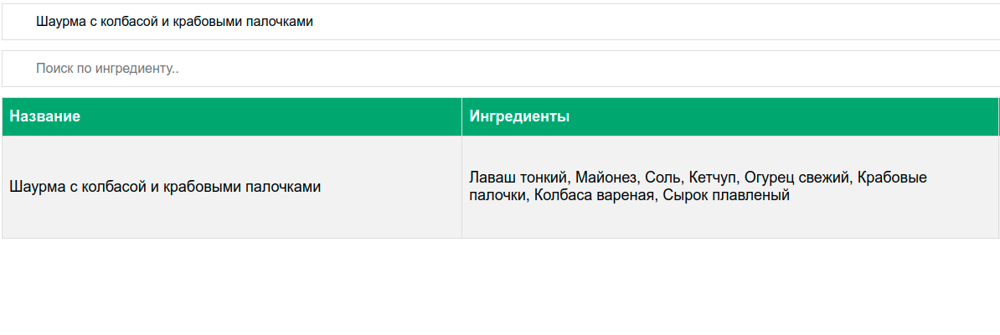
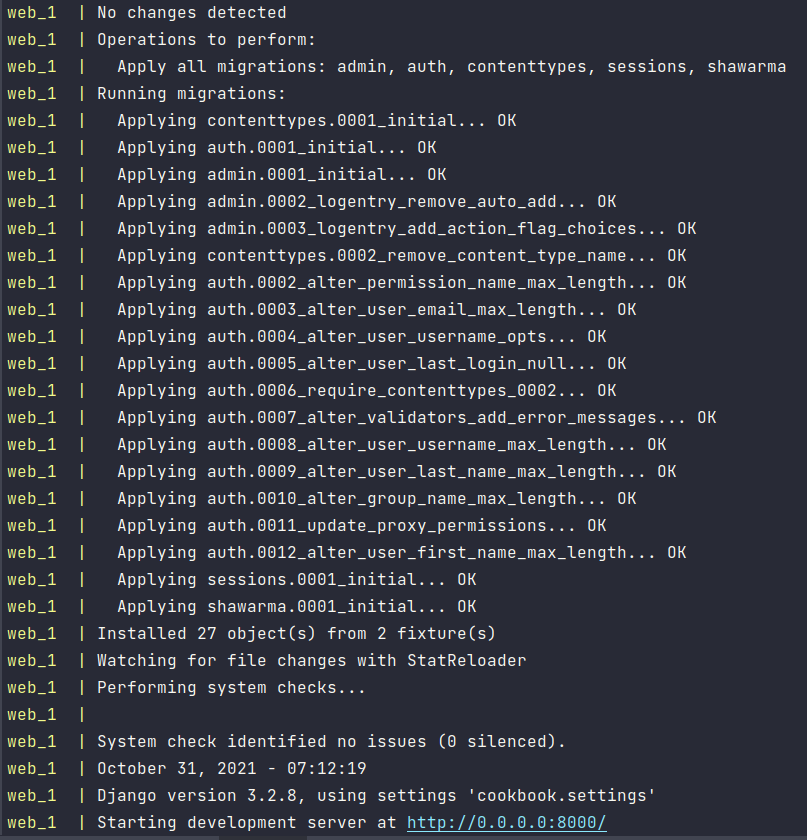

<h1 align="center">Книга рецептов</h1>


Веб-сайт, использующий фреймворк Django 3


<h2 align="center">Инструкция по запуску</h2>

При первом запуске проекта необходимо воспользоваться командой из корня репозитория

 Первая собирает конейтнер с СУБД
 
 Команда собирает контейнер с веб-приложением и связанные с ним контейнеры
 
 ```bash
 docker-compose up -d --build web
 ```
 После этого проект будед доступен по адресу http://127.0.0.1:8000
 
 Для выполнеия команд внутри контейнера web, нужно выполнить команду.

```shell
docker-compose exec web sh
```
<h2 align="center">Добавление новых рецептов и фильтрация</h2>

<p>В панели управления (/admin) пользователь имеет возможность ввести:</p>

1. список ингредиентов для рецепта;

2. добавить текст и название рецепта.

Ингредиенты выбираются из списка, а не вводтся вручную, так как предпологается, что так база данных не будет засоряться разными или ошибочными названиями одних и тех же ингредиентов.
Что может осложнять поиск.


<p>В публичной части сайта пользователь имеет возможность просмотра введенных рецептов с выводом ингредиентов, с возможностью фильтрации по ингредиентам и названию рецепта.
Учтено, что один ингредиент может встречаться в нескольких рецептах.</p>

<div>
    <p>Поиск по названию</p>
    
    <p>Поиск по ингредиенту</p>
    
</div>

<h2 align="center">Структура проекта</h2>

В структуре проекта:

- Разметка страницы содержится в файле home.html 

```
cookbook/shawarma/templates/home.html
```

- Стиль в stylesheet.css

```
cookbook/static/css/stylesheet.css
```

- Скрипт для фильтрации по названию и ингредиентам в main.js

```
cookbook/static/js/main.js
```

- Модели таблиц описаны в models.py

```
cookbook/shawarma/models.py
```


<h2 align="center">Модели</h2>

Один ингредиеент может встречаться в нескольких рецептах, потому при описании моделей использована связь многие ко многим

```python
from django.db import models


class Shawarma(models.Model):
    name = models.CharField(max_length=100)
    ingredients = models.ManyToManyField('Ingredient', blank=False)
    description = models.TextField()


class Ingredient(models.Model):
    name = models.CharField(max_length=50)

    def __str__(self):
        return self.name
```

Благодаря такому подходу создается табица, в которой каждому рецепту соответствует отдельный ингредиент. Таким образом база данных приобретает третью нормальную форму


</br>

<p>При первом запуске проекта база данных наполняется данными благодаря миграции и добавлению фикстур.</p>



Такое поведение заложено в файле docker-compose.yml, который вместе с Dockerfile находятся в корне репозитория

<h2 align="center">Файл docker-compose.yml</h2>

Команды в файле docker-compose.yml для миграции, загрузки фикстур и старт сервера

```python
command: >
      sh -c "
             python ./cookbook/manage.py makemigrations &&
             python ./cookbook/manage.py migrate &&
             python ./cookbook/manage.py loaddata name ingredients &&
             python ./cookbook/manage.py runserver 0.0.0.0:8000"
```

В качестве СУБД использована PostgreSQL 14

```python
db:
    image: postgres:14.0-alpine
    environment:
      - POSTGRES_USER=hello_django
      - POSTGRES_PASSWORD=hello_django
      - POSTGRES_DB=cookbook_db
    ports:
      - 5432:5432
```
Веб-приложение запускается в отдельном контейнере после запуска контейнера с СУБД

```python
services:
  web:
    build:
      context: ./
      dockerfile: Dockerfile
    command: >
      sh -c "
             python ./cookbook/manage.py makemigrations &&
             python ./cookbook/manage.py migrate &&
             python ./cookbook/manage.py loaddata name ingredients &&
             python ./cookbook/manage.py runserver 0.0.0.0:8000"
    volumes:
      - ./cookbook/:/cookbook
    ports:
      - 8000:8000
    env_file:
      - ./.env.dev
    depends_on:
      - db
```

<h2 align="center">Источники информации</h2>

Документация

- [Django](https://www.djangoproject.com/)
- [Providing initial data for models](
  https://docs.djangoproject.com/en/3.2/howto/initial-data/
  )
  
- [Quickstart: Compose and Django](https://docs.docker.com/samples/django/)
- [Docker in DataGrip](https://www.jetbrains.com/help/datagrip/docker.html)
- [docker rm](https://docs.docker.com/engine/reference/commandline/rm/)
- [docker rmi](https://docs.docker.com/engine/reference/commandline/rmi/)
- [Using the Django authentication system](
  https://docs.djangoproject.com/en/1.8/topics/auth/default/
  )
  
Книги

- Использование Docker (Эдриен Моуэт)
- Two Scoops Of Django 3
- Дэн Бейдер: Чистый Python. Тонкости программирования для профи


StackOverflow
- [Postgres django.db.utils.OperationalError: could not connect to server: Connection refused](
    https://stackoverflow.com/questions/52355898/postgres-django-db-utils-operationalerror-could-not-connect-to-server-connecti
)
- [Using Docker-Compose, how to execute multiple commands](
  https://stackoverflow.com/questions/30063907/using-docker-compose-how-to-execute-multiple-commands
  )
- [docker-compose gives ERROR: Cannot locate specified Dockerfile: Dockerfile](
  https://stackoverflow.com/questions/36236491/docker-compose-gives-error-cannot-locate-specified-dockerfile-dockerfile
  )
  
- [what's the difference between migrate and makemigrations?](
  https://stackoverflow.com/questions/29980211/django-1-8-whats-the-difference-between-migrate-and-makemigrations
  )
  
- [How do I get into a Docker container's shell?](
  https://stackoverflow.com/questions/30172605/how-do-i-get-into-a-docker-containers-shell
  )
  
- [How to remove old Docker containers](
  https://stackoverflow.com/questions/17236796/how-to-remove-old-docker-containers
  )
  
- [How can I delete Docker's images?](
  https://stackoverflow.com/questions/21398087/how-can-i-delete-dockers-images
  )
  
  
- [How do i set two pictures on the same line using html and css?](
  https://stackoverflow.com/questions/61940802/how-do-i-set-two-pictures-on-the-same-line-using-html-and-css
  )
  
- [How to automate createsuperuser on django?](
  https://stackoverflow.com/questions/6244382/how-to-automate-createsuperuser-on-django
  )

GitHub
- [Каталог Книг](https://github.com/MNV/django-booklist)
- [django_projects](https://github.com/DrPierreChang/django_projects)

Хабр

- [Итерируемый объект, итератор и генератор](https://habr.com/ru/post/337314/)

YouTube

- [Setting up PostgreSQL database with a Django Docker application](
  https://youtu.be/610jg8bK0I8
  )
- [Docker | How to Dockerize a Django application (Beginners Guide)](
  https://youtu.be/W5Ov0H7E_o4
  )

Другое

- [requirements.txt — что это и зачем?](
  https://semakin.dev/2020/04/requirements_txt/)
  
- [OCI runtime exec failed: exec failed](
  https://www.reddit.com/r/docker/comments/fru7wp/oci_runtime_exec_failed_exec_failed/
  )
  
- [Настройка и подключение статических файлов в Django](
  https://pythonru.com/uroki/django-static
  )
- [String.length JavaScript](
  https://developer.mozilla.org/ru/docs/Web/JavaScript/Reference/Global_Objects/String/length
  )
- [CSS Tables](https://www.w3schools.com/css/css_table.asp)
- [Операторы сравнения в JavaScript](
  https://flagman.top/about-business/php-i-t-p-uzelki/operatory-sravneniya-v-javascript#:~:text=Сравнение%20строк%20в%20JavaScript.%20Cтроки,имеют%20больший%20код%20в%20Unicode)
  )
  
- [Условное ветвление: if, '?' JavaScript](
  https://learn.javascript.ru/ifelse
  )
  
- [JavaScript Table Filter or Search](
  https://webdevtrick.com/javascript-table-filter/)
  
- [How TO - Filter/Search Table](
  https://www.w3schools.com/howto/howto_js_filter_table.asp
  )
  
- [Как использовать Django, PostgreSQL и Docker](
  https://webdevblog.ru/kak-ispolzovat-django-postgresql-i-docker/
  )
  
- [Gitignore for a Django project](
  https://djangowaves.com/tips-tricks/gitignore-for-a-django-project/)
  
- [How to set up environment variables in Django](
  https://alicecampkin.medium.com/how-to-set-up-environment-variables-in-django-f3c4db78c55f
  )
  
- [Using Environment Variables In Django](
  https://djangocentral.com/environment-variables-in-django/
  )
  
  <h2 align="center">Что можно улучшить</h2>
  
Команда docker-compose up --build для запуска сборки нескольких контейнеров

Если ее использовать при первом запуске проекта, то сборка контейнера web стартует сразу после старта сборки контейнер db, и хотя инициализация db еще не закончилась, начинается миграция. Из-за этого  возникает ошибка.
   
Самое простое решение предложено на StackOverflow [тут](https://stackoverflow.com/questions/52355898/postgres-django-db-utils-operationalerror-could-not-connect-to-server-connecti) - последовательный запуск сборки контейнеров

Но возможно необходимо как-то перестроить логику взаимодействия контейнеров
